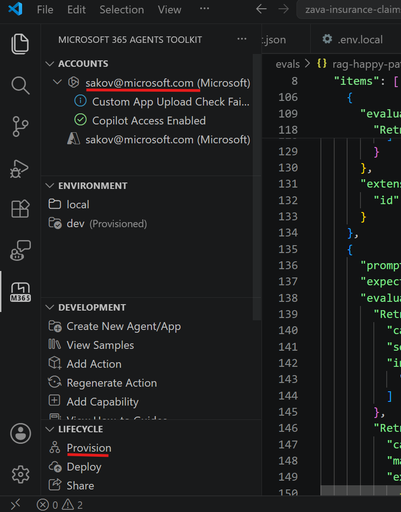
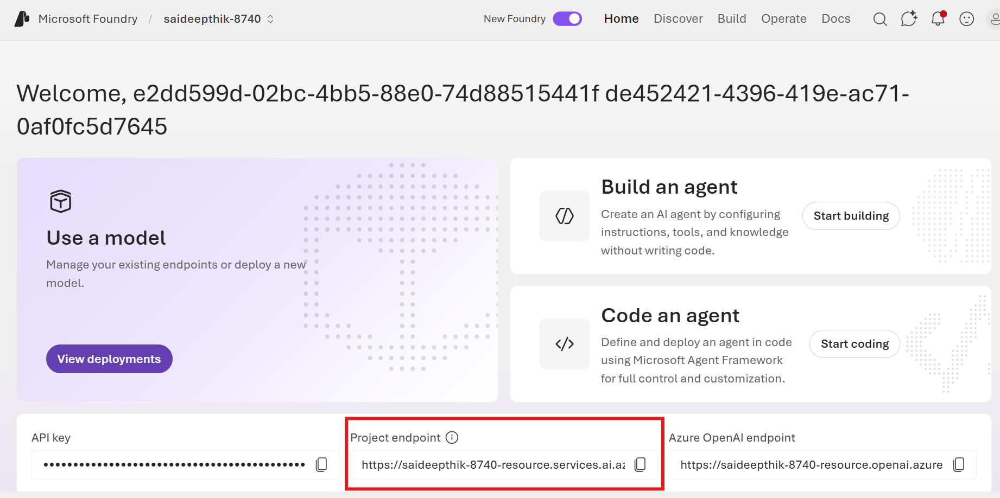
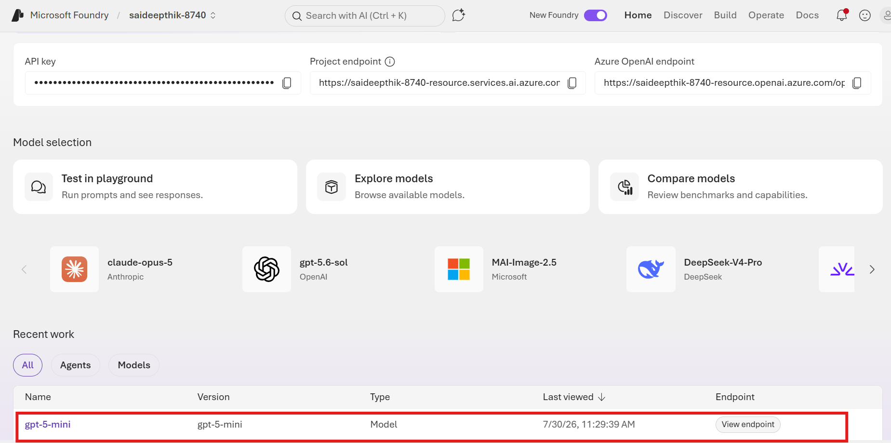
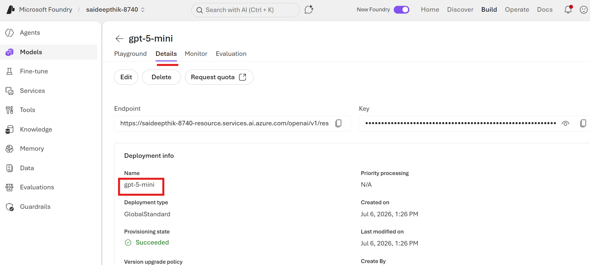

# Bug Bash Retrieval Evaluators on Zava Insurance Claims Agent

---

## 1. Prerequisites

| Tool | Why |
|---|---|
| **Git** and a **GitHub account** | Required to clone this repository from GitHub. Install Git from <https://git-scm.com/downloads> and confirm it with `git --version`. |
| **VS Code** | Host for the M365 Agents Toolkit extension that provisions the agent. |
| **Microsoft 365 Agents Toolkit** (VS Code extension) | Signs you into M365, builds the agent app package, and uploads it to your tenant. Make sure the ATK side bar icon appears on the left rail.|
| **Node.js 18+** and **npm** | Required to install the `@microsoft/m365-copilot-eval` CLI. |
| **Python 3.10+** | Required by the eval CLI runtime. |
| **Microsoft 365 test tenant** | Use an **MSIT** or **WW test tenant** to provision the agent and complete this tutorial. |
| **Access to the Zava Claims SharePoint site** | The agent's knowledge source - 'https://microsoft.sharepoint-df.com/sites/CXDev/Shared Documents/Zava Insurance Documents' |

These prerequisites apply to Windows, macOS, and Linux. The current eval CLI
requires Node.js 24.12.0 or newer, while GitHub Copilot CLI installed through
npm requires Node.js 22 or newer. Windows users also need PowerShell 6 or
newer.

---

## 2. Install and provision the Zava Insurance Claims agent (via the ATK extension)

### 2.1  Get the agent project locally

**Windows (PowerShell):**

```powershell
git clone https://github.com/sakov-ms/evalsclicodecamp.git
cd evalsclicodecamp\zava-insurance-claims
```

**macOS and Linux:**

```bash
git clone https://github.com/sakov-ms/evalsclicodecamp.git
cd evalsclicodecamp/zava-insurance-claims
```

You should end up with a folder containing `appPackage\`, `env\`, `teamsapp.yml`, etc.

### 2.2  Open the agent folder in VS Code
1. Open VS code. Click on File → Open Folder
2. Select zava-insurance-claims folder that was downloaded in #1

From a terminal on Windows, macOS, or Linux, you can alternatively run:

```text
code .
```


### 2.3  Sign in and provision

1. Click the **Microsoft 365 Agents Toolkit** icon in the side bar.
2. Under **ACCOUNTS**, sign in to:
   - **Microsoft 365** — the account/tenant that will host the agent.
   - **Azure** — not required for this bug bash.
3. Under **LIFECYCLE**, click **Provision**.
4. In the prompt, choose the environment **`local`**.
5. ATK builds the app package (`appPackage\build\appPackage.local.zip`) and uploads it to your tenant. Watch the *Output* panel for progress; provisioning completes in 1–2 minutes.



The ATK extension workflow is the same on Windows, macOS, and Linux.

### 2.4  (Optional) Point the knowledge source at your own SharePoint

The agent's `appPackage\declarativeAgent.json` references:
```
https://microsoft.sharepoint-df.com/sites/CXDev/Shared Documents/Zava Insurance Documents
```
If your account does not have access, edit the `OneDriveAndSharePoint` capability's `items_by_url[0].url` to point at a SharePoint site **you own** that contains the Zava claims policy guidebook, then re-run **Provision**.

### 2.5  Try the agent in Microsoft 365 Copilot

1. Open **<https://copilot.microsoft.com>** in your browser, signed in with the same M365 account you used in ATK.
2. Click the **agent picker** (top of the chat / right side panel) and choose **Zava Insurance Claims (local)**.
3. Try one of the built-in conversation starters:
   - *"For a dwelling claim on a property with a mortgage, when is a joint check with the mortgage company required?"*
   - *What is a deductible and what standard deductible options are available for Zava HomeShield homeowners policies?*
   - *"What does our claims documentation say about the approval process?"*
   - *"Show me the details for claim CN202504990"*

If the agent responds and (for knowledge prompts) cites the SharePoint doc, you're ready to run evaluations.

---

## 3. Install the eval CLI

The CLI is published on npm: **<https://www.npmjs.com/package/@microsoft/m365-copilot-eval>**. Install it globally so the `runevals` command is on your PATH:

**Windows, macOS, and Linux:**

```text
npm install -g @microsoft/m365-copilot-eval@latest
```

Verify:

```text
runevals --version
runevals --help
```

> The installed eval CLI version must be **1.15.0 or later**.
> If `runevals` is not recognized, ensure your npm global bin folder is on PATH:
> `npm config get prefix` → add `<that path>` (Windows) or `<that path>/bin` (macOS/Linux) to PATH.

---

## 4. Install and launch GitHub Copilot CLI

An active GitHub Copilot subscription is required. If your organization manages
Copilot, its policy must allow GitHub Copilot CLI.

### Windows

```powershell
winget install GitHub.Copilot
winget install --id GitHub.cli
copilot --version
gh auth login
copilot
```

When Copilot CLI opens, enter `/login` if prompted. After authentication, enter
`/version` to confirm that the interactive session launched successfully.

### macOS

Install Microsoft Company Portal before the first M365 authentication flow.
The broker authentication flow has a known limitation on Intel-based Macs;
Apple Silicon Macs are not affected.

```bash
brew install --cask copilot-cli
brew install gh
copilot --version
gh auth login
copilot
```

When Copilot CLI opens, enter `/login` if prompted, then enter `/version`.

### Linux

Using Homebrew for Linux:

```bash
brew install --cask copilot-cli
brew install gh
copilot --version
gh auth login
copilot
```

Alternatively, install Copilot CLI with the official script:

```bash
curl -fsSL https://gh.io/copilot-install | bash
```

Install the M365 authentication broker dependencies on Debian or Ubuntu:

```bash
sudo apt update
sudo apt install libwebkit2gtk-4.1-0 libdbus-1-dev python3-gi gir1.2-secret-1 libubsan1
```

When Copilot CLI opens, enter `/login` if prompted, then enter `/version`.

---

## 5. Register the included M365 evals skill

This repository includes the skill at `skills/m365-evals-cli`.

From the repository root, register it with Copilot CLI:

**Windows (PowerShell):**

```powershell
copilot skill add .\skills
copilot skill list
```

**macOS and Linux:**

```bash
copilot skill add ./skills
copilot skill list
```

### Verify that the skill is installed

Run the verification command for your platform:

**Windows (PowerShell):**

```powershell
copilot skill list | Select-String 'm365-evals-cli'
```

**macOS and Linux:**

```bash
copilot skill list | grep 'm365-evals-cli'
```

The output should contain `m365-evals-cli`. If no matching line appears, run
the `copilot skill add` command again from the repository root.

If Copilot CLI is already open, run:

```text
/skills reload
/skills info m365-evals-cli
```

The `/skills info` command should display the skill name, description, and
source. This confirms that the current Copilot CLI session can use it.

You can also install it as a personal skill by copying the
`m365-evals-cli` folder into `~/.copilot/skills/`.

---

## 6. Run an evaluation

Start Copilot CLI from the agent or evaluation workspace:

**Windows, macOS, and Linux:**

```text
copilot
```

Then enter:

```text
Can you run evals on my zava-insurance-claims agent using the evals-cli skill?
```

The skill checks the eval CLI version and environment, runs with the GitHub
Copilot judge, starts with concurrency `1`, and writes timestamped results and
debug logs under `.evals`.

When the evaluation finishes, an HTML report opens in your browser and displays
the scorecard. If you see the scorecard, you successfully ran your first
evaluation. Congratulations!

The skill also asks whether you want it to analyze the report. You can accept
to receive a summary of pass rates, failed prompts, evaluator reasons, and
recommended next steps, or decline and review the HTML scorecard yourself.

The remaining exercises are advanced steps.

### Advanced: Run Custom Evaluators on your agent

The repository includes the custom evaluators and datasets required for this
exercise:

```text
zava-insurance-claims/
├── custom-evaluators/
│   ├── AssertionJudge/
│   │   ├── AssertionJudge.py
│   │   └── AssertionJudge.prompty
│   └── answer_length/
│       └── answer_length.py
└── evals/
    ├── zava-insurance-claims.json
    └── custom-answer-length-gpt5.json
```

The `zava-insurance-claims.json` dataset uses the Prompty-based
`AssertionJudge` custom evaluator. It requires an Azure OpenAI deployment.
Follow the steps below to deploy a model in the Microsoft Foundry portal and
gather the variables to add to the `.env` files so the evals tool can use them
to run an evaluation.

#### Deploy GPT-5 mini in Microsoft Foundry and use it in Evals CLI

Use the deployment flow from
[Get your Azure OpenAI endpoint and API key](https://learn.microsoft.com/microsoft-365/copilot/extensibility/evaluations-cli-get-env-values#get-your-azure-openai-endpoint-and-api-key),
but deploy `gpt-5-mini` instead of the GPT-4 model shown in that guide:

1. Sign in to the [Azure portal](https://portal.azure.com).
2. Search for **OpenAI**, select **Azure OpenAI**, and select **Create**.
3. Complete the **Create AI Foundry resource** form, then select
   **Review + create**.
4. After deployment completes, open the resource in the
   [Microsoft Foundry portal](https://ai.azure.com).
5. Open **Models + endpoints**. In the newer Foundry interface, select
   **Models**.
6. Select **Deploy model** > **Deploy base model**.
7. Select **gpt-5-mini**, confirm the deployment settings, and select
   **Deploy**. GPT-5 mini is supported for this Foundry cloud-evaluation path.
8. Wait for the deployment to report **Succeeded**.

You need the **Azure AI Developer** role on the project and Azure CLI
authentication through Microsoft Entra.

From the Foundry project home page, copy the **Project endpoint**:



Under **Recent work**, select the GPT-5 deployment:



On the deployment's **Details** tab, copy the deployment **Name**:



Sign in to the tenant that contains the Foundry project:

```text
az login
```

If the project is in another tenant, use:

```text
az login --tenant <tenant-id>
```

Add the following values to `.env.dev` or `.env.local`:

```dotenv
AZURE_AI_OPENAI_ENDPOINT="https://<resource>.openai.azure.com/"
AZURE_AI_MODEL_NAME="<deployed-gpt-5x-deployment-name>"
```

In Copilot CLI, enter:

```text
Can you run an evaluation for the zava-insurance-claims agent using the evals CLI and the dataset "zava-insurance-claims\evals\zava-insurance-claims.json"? This dataset uses the AssertionJudge custom evaluator, so use the Azure judge configuration.
```

On macOS and Linux, use
`zava-insurance-claims/evals/zava-insurance-claims.json`.

Configure `.env.dev` or `.env.local`:

```dotenv
AZURE_AI_PROJECT_ENDPOINT="https://<account>.services.ai.azure.com/api/projects/<project>"
AZURE_AI_MODEL_NAME="gpt-5-mini"
```

These are the only two additional variables required for the Foundry judge.
The Foundry path uses Entra authentication; `AZURE_AI_OPENAI_ENDPOINT`,
`AZURE_AI_API_KEY`, and `AZURE_AI_API_VERSION` are not used.

Run the included GPT-5 dataset from the `zava-insurance-claims` folder:

**Windows (PowerShell):**

```powershell
runevals `
  --env local `
  --prompts-file .\evals\custom-answer-length-gpt5.json `
  --concurrency 1
```

**macOS and Linux:**

```bash
runevals \
  --env local \
  --prompts-file ./evals/custom-answer-length-gpt5.json \
  --concurrency 1
```

When `AZURE_AI_PROJECT_ENDPOINT` and `AZURE_AI_MODEL_NAME` are set, the
built-in LLM evaluators automatically use Microsoft Foundry cloud evaluation.
The results and report format remain unchanged.

For additional configuration and troubleshooting, continue with the
[advanced custom evaluators guide](docs/advanced-custom-evaluators.md).

### Advanced: Run Retrieval Evaluators with a specific dataset

Ask Copilot CLI to run the bundled retrieval-evaluator dataset:

```text
Can you run an evaluation using the evals cli skill for the zava-insurance-claims agent for the dataset - "zava-insurance-claims\evals\rag-happy-paths-bundle.json" and use the Azure judge configuration.
```

On macOS and Linux, use
`zava-insurance-claims/evals/rag-happy-paths-bundle.json`.

Treat reports and debug logs as potentially sensitive because they can contain
prompts, agent responses, citations, or retrieved workplace content.

---

## 7. The prioritized datasets

PR #360 is about retrieval evaluators, so all datasets are RAG focused

### RAG (`evals/rag-*.json`) — 8 tests

| Priority | File | What it covers | Expected outcome |
|---|---|---|---|
| **P1** | `rag-01-mortgage-joint-check-threshold.json` | Happy `RetrievalQuery` + `RetrievalResult` baseline — mortgage joint-check threshold ($10K) from §8.4 | **Pass** |
| **P1** | `rag-07-failure-no-matching-query.json` | Failure code `no_matching_query` | **Fail** (intended) |
| **P1** | `rag-08-failure-required-terms-missing.json` | Failure code `required_terms_missing`; `includes_missing=['unicorn']` | **Fail** (intended) |
| **P1** | `rag-09-failure-excluded-terms-found.json` | Failure code `excluded_terms_found`; `excludes_found=['claim']` | **Fail** (intended) |
| **P1** | `rag-10-failure-not-retrieved.json` | Failure code `not_retrieved` (or `error` if capability had no hits) | **Fail** (intended) |
| **P2** | `rag-03-deductibles-min-count.json` | `min_expected_count` count-only path (§2 Definitions + §6.1 HomeShield) | **Pass** |
| **P2** | `rag-11-max-rank-boundary-strict.json` | `max_rank: 1` boundary — Claims Timeline (§8.3) | **Fail** (likely) |
| **P2** | `rag-12-max-rank-boundary-relaxed.json` | Same prompt as rag-11, `max_rank: 20` — proves `max_rank` is honored | **Pass** |


---

## 8. Filing bugs

File every finding as a **new issue** in the private repo:

🐞 **<https://github.com/microsoft/M365-Copilot-Agent-Evals/issues/new>**

### Required steps
1. Open the link above (you must have read access to the private `microsoft/M365-Copilot-Agent-Evals` repo).
2. Give the issue a **clear, specific title** — e.g. `runevals resolves --prompts-file relative to npm install dir, not cwd`.
3. **Add the `bugbash` label** (Labels gear on the right side of the issue form → search for `bugbash` → select it). This is how the team triages bug-bash findings.
4. (Recommended) Run the commands with `--log-level debug` for rich logs. Please add screenshots and the logs/ error messages in the issue. 

### Include in the issue body
- The **dataset file** used (e.g. `rag-08-failure-required-terms-missing.json`) — attach or paste the JSON.
- The **full evaluator output JSON** from the report (`matched_items`, `missing_items`, `extract_failures`, `matched_queries`, `includes_missing`, `excludes_found`).
- The **CLI version**: output of `npm ls -g @microsoft/m365-copilot-eval`.
- The **exact command** you ran.
- A **screenshot of the HTML report card** (`.evals\<timestamp>.html`) for the failing prompt.
- The **relevant chunk of the `--log-level debug` console output** (redact tokens).
- **Expected vs. actual** behavior in 1–2 sentences.

> ⚠️ Do NOT paste secrets — scrub `AZURE_AI_API_KEY`, bearer tokens, and tenant-specific URLs from logs before posting.

---

## 9. Troubleshooting

### Prepare the agent environment and run an evaluation

The evals CLI skill normally performs these checks. Use the following steps
only if the skill reports that it cannot find the required environment file,
tenant ID, or agent ID.

Run commands from inside the `zava-insurance-claims` folder.

Agents Toolkit normally generates an `env` folder with either an `.env.dev` or
`.env.local` file. Confirm it contains the following non-empty values:

```dotenv
M365_TITLE_ID="T_your-title-id-here"
TEAMS_APP_TENANT_ID="your-tenant-id"
```

For an existing deployed agent that is not in an ATK project, create an `env`
folder with either an `.env.dev` or `.env.local` file containing the same
variables.

#### Find the tenant ID and agent ID

For an ATK project, provisioning normally writes both values to `.env.dev` or
`.env.local` in either the project root or the `env` folder.

**Windows (PowerShell):**

```powershell
Select-String `
  -Path .\.env.dev, .\.env.local, .\env\.env.dev, .\env\.env.local `
  -Pattern '^(M365_TITLE_ID|TEAMS_APP_TENANT_ID)=' `
  -ErrorAction SilentlyContinue
```

**macOS and Linux:**

```bash
grep -E '^(M365_TITLE_ID|TEAMS_APP_TENANT_ID)=' \
  ./.env.dev ./.env.local ./env/.env.dev ./env/.env.local 2>/dev/null
```

If the tenant ID is not in an environment file, retrieve it from Azure:

1. Sign in to the [Azure portal](https://portal.azure.com).
2. Open **Microsoft Entra ID**.
3. Open **Overview**.
4. Copy **Tenant ID** and use it as `TEAMS_APP_TENANT_ID`.

You can also retrieve the tenant ID with Azure CLI:

```text
az account show --query tenantId --output tsv
```

For the agent ID:

- **ATK agent:** use `M365_TITLE_ID` from `.env.dev` or `.env.local` after
  provisioning.
- **Existing non-ATK agent:** obtain `M365_AGENT_ID` from the Microsoft Teams
  admin center, Microsoft 365 admin center, or the publishing pipeline output.
  Supported IDs are typically user-scoped (`U_...`) or tenant-scoped
  (`T_...declarativeAgent`).
- Do **not** substitute the Microsoft Entra **Application (client) ID** shown in
  Azure Portal. That GUID identifies an app registration, not the M365 agent
  title ID expected by `runevals`.

To override the environment value for one run:

```text
runevals --judge-backend github-copilot --m365-agent-id "<agent-id>"
```

**Windows (PowerShell):**

```powershell
New-Item -ItemType Directory -Force env
notepad .\env\.env.dev # Or use: notepad .\env\.env.local
```

**macOS and Linux:**

```bash
mkdir -p env
${EDITOR:-nano} ./env/.env.dev # Or use: ${EDITOR:-nano} ./env/.env.local
```

### Common issues

| Symptom | Cause / Fix |
|---|---|
| `runevals : The term 'runevals' is not recognized` | npm global bin folder isn't on PATH. Run `npm config get prefix` and add that folder (Windows) or `<that>/bin` (Mac/Linux) to PATH; reopen the terminal. |
| The installed CLI is old even after an update | A stale global shim may be earlier on PATH. Compare `npm view @microsoft/m365-copilot-eval version`, `npm list -g @microsoft/m365-copilot-eval --depth=0`, and `runevals --version`. On Windows, use `Get-Command runevals -All`; on macOS/Linux, use `which -a runevals`. |
| `FileNotFoundError` for `judge_prompts.json` | Older packages containing the GitHub Copilot judge omitted this file. Upgrade to the current `@latest` package. Version 1.15.0 includes the file; do not remain on an affected 1.12.x or 1.13.x package. |
| Node.js version or engine error | The current eval CLI requires Node.js 24.12.0 or newer. Upgrade Node.js, reopen the terminal, and confirm with `node --version`. |
| EULA has not been accepted | Run `runevals accept-eula`, then rerun the evaluation. |
| GitHub authentication failed for the Copilot judge | Run `gh auth status`, then `gh auth login` if needed. Confirm the signed-in account has an active GitHub Copilot subscription and that organizational policy permits Copilot CLI. |
| Copilot judge model is unavailable | Leave `GITHUB_COPILOT_JUDGE_MODEL` unset to use `auto`, or set it to a model available to the signed-in account. There is no `--judge-model` flag. |
| `ERROR Missing required environment variables: …` | Neither `env\.env.dev` nor `env\.env.local` was found with the required values. Confirm you ran the command from the `zava-insurance-claims` folder and that `M365_TITLE_ID` and `TEAMS_APP_TENANT_ID` are populated using the preparation guidance above. |
| No prompts file was found | Run from the workspace root and confirm a supported `prompts.json`, `evals.json`, or `tests.json` exists in the current directory or under `evals`. Use `--prompts-file <path>` when more than one dataset exists or auto-discovery chooses the wrong file. |
| Agent not found or inaccessible | Confirm the agent is deployed in the tenant identified by `TEAMS_APP_TENANT_ID`, that `M365_TITLE_ID` is correct, and that the signed-in M365 account can open the agent in Microsoft 365 Copilot. |
| M365 sign-in fails on macOS or Linux | On macOS, install Company Portal; Intel Macs currently have a known broker limitation. On Debian/Ubuntu, install the broker libraries listed in §4 before rerunning. |
| Python runtime download, TLS, certificate, or proxy failure | The CLI downloads and caches Python 3.13.x. Confirm HTTPS access to npm and the runtime download endpoints. Configure the organization's approved `HTTPS_PROXY` and certificate trust settings when required; do not disable TLS validation. |
| HTTP 503 or `no healthy upstream` | The M365 agent service is temporarily unavailable. Wait and rerun later. Start with `--concurrency 1`; repeated 503 responses are an agent-service failure, not a GitHub Copilot judge score. |
| `Schema validation error: Document validation failed` | The dataset has a field the schema rejects (e.g. `id` at item root, or an unknown evaluator like `ToolCallAccuracy`). Move custom keys under `extensions`; only use evaluators in `EvaluatorMap` (Relevance, Coherence, Groundedness, Similarity, Citations, ExactMatch, PartialMatch, RetrievalQuery, RetrievalResult). |
| A custom LLM evaluator is skipped | User-authored `.prompty` LLM evaluators are not currently routed through the GitHub Copilot judge. Use built-in LLM evaluators or code-only custom evaluators, or use the Azure judge for that custom Prompty evaluator. |
| HTML report is empty / no aggregates | Agent didn't respond. Re-test the agent in <https://copilot.microsoft.com>; check WorkIQ A2A endpoint reachability and token acquisition; confirm the agent is provisioned in the same tenant as `TEAMS_APP_TENANT_ID`. |
| Agent provision fails in VS Code | Check the *Output* panel → *Microsoft 365 Agents Toolkit* channel. Common causes: not signed into M365, custom-app-upload disabled in tenant (admin must enable it), or SharePoint site is inaccessible. |
| GitHub Copilot judge throttling or hourly-limit errors | This is a known issue when the account exceeds its hourly request limit. Wait one hour, then rerun the evaluation. Split large datasets into smaller files for reruns; datasets containing approximately 40 queries usually complete without throttling problems. |

---

## 10. Cleanup

**Windows (PowerShell):**

```powershell
Remove-Item -Recurse -Force .\.evals
# Optional: uninstall the CLI
npm uninstall -g @microsoft/m365-copilot-eval
```

**macOS and Linux:**

```bash
rm -rf ./.evals
# Optional: uninstall the CLI
npm uninstall -g @microsoft/m365-copilot-eval
```
